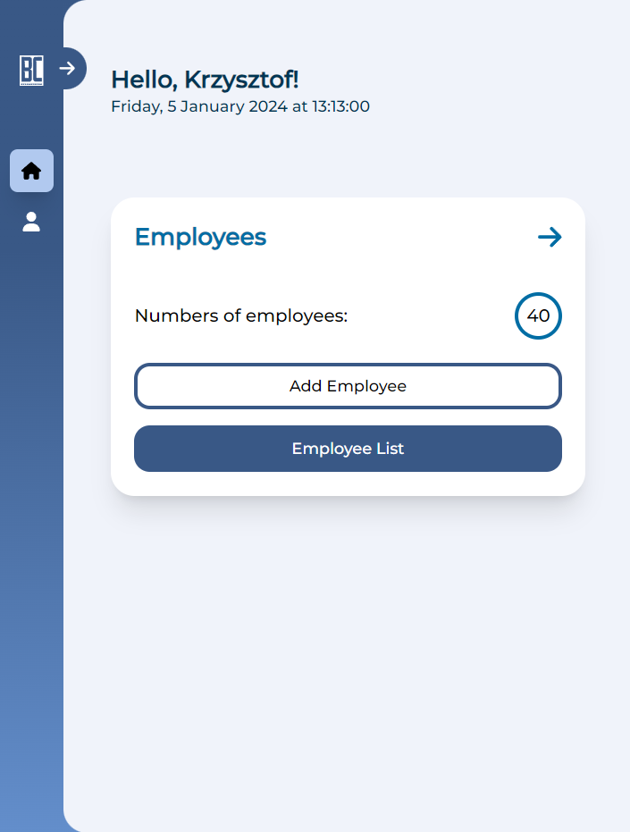
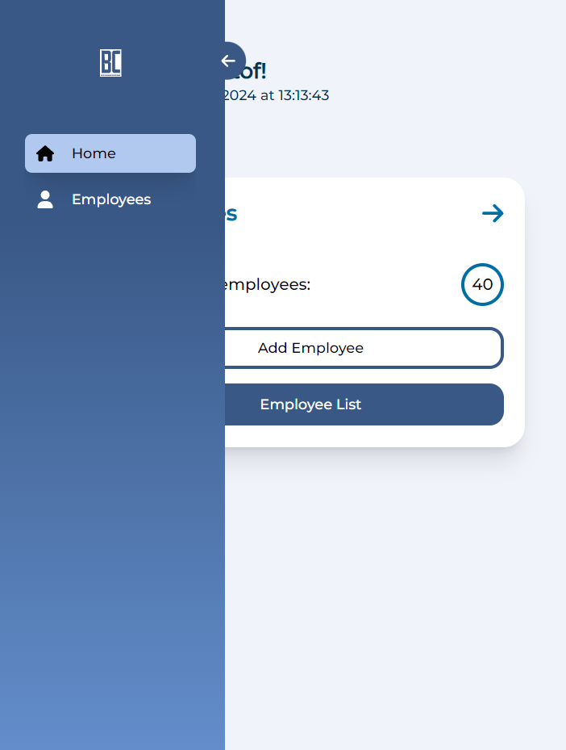
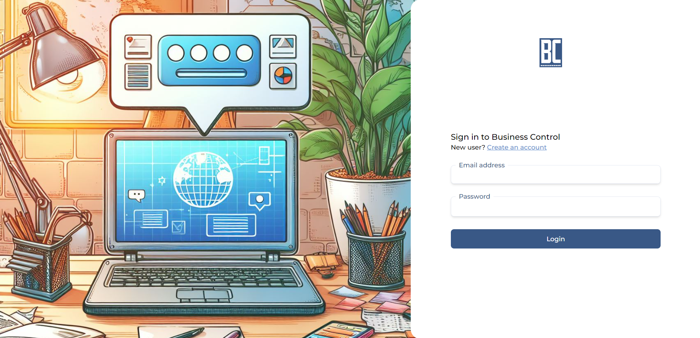

# BusinessControl

BusinessControl is an application designed for people who want to manage their business efficiently.

## Table of Contents

- [General Information](#general-information)
- [Build With](#build-with)
- [Features](#features)
- [Screenshots](#screenshots)
- [Roadmap](#roadmap)
- [Contact](#contact)

## General Information

BusinessControl is business software that integrates different areas of a company's business into a single platform. It allows the management of employees, control of finances, monitoring of the warehouse and management of production. The application Server is built using Python and the Django framework, the Client is built using React and Typescript.

## Build With

- Django
- React
- Redux
- RTK Query
- Typescript
- Tailwind
- Postgresql
- Jest

## Features

- Human Resources Management - in progress

## Screenshots

  
  
  

## Roadmap

Project is under active development. Future updates may include:

- User Authentication
- Human Resources Management
- Financial Management
- Warehousing and Logistics Management
- Customer Relationship Management
- Manufacturing Management
- Integration with Other Systems (e.g. MS Teams)

## Contact

Author: Krzysztof Lesiak

[LinkedIn](https://www.linkedin.com/in/lesiak-krzysztof/) |
[GitHub](https://github.com/KrzysztofLesiak)
